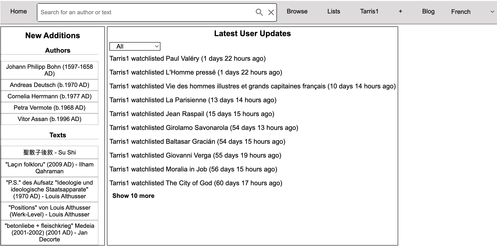

# Lectura: a better way to discover literature!

Discovering and managing literature is an integral part of any reader's life.  How can I ensure that I have control over the books I want to read, the books I own, the books that I have read? How can I find books that are similar to my very favorites? Perhaps an obscure 17th century author from a region you have never explored will fill this need? Perhaps you were not aware that Marcel Proust wrote a lengthy book prior to his infamous *In Search of Lost Time* during which he experimented with his novel *stream of consciousness* style? With this platform, I aim to answer all (and any other you may have) of these questions!

---

## Features:
- Front-end written in **React.JS**, supplemented inevitably with some **HTML** and **CSS**
- Back-end: utilizes **Python** (API solved by **fastAPI**, data handling through **Pandas**), **PostgreSQL** (database), and **SPARQL** (RDF query language connecting to Wikipedia's database Wikidata)
- **Remains to be deployed**

---

### Key Metrics:
- **Authors available with a text attached**: 60,868
- **Total amount of authors**: 791,773
- **# Texts available**: 295,648

---

### Challenges:
1. **Incomplete data**: A significant amount of authors do not have texts attached to them in wikidata, and a significant amount of authors with texts attached to them are incomplete.
- Plan to supplement text data from other sources (i.e. ISNI)
2. **Data Quality assurance**: Difficult to ensure that adjustments are accurate.
- Plan to attach sources when available to data points

---

### Visualizations:
Examples of how the platform looks like at the moment:

---

### Links:
- [GitHub Repository](https://github.com/Lecturaorg)